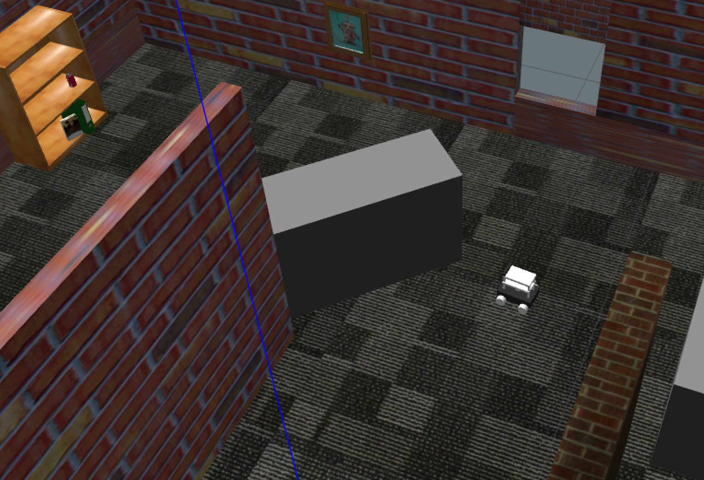
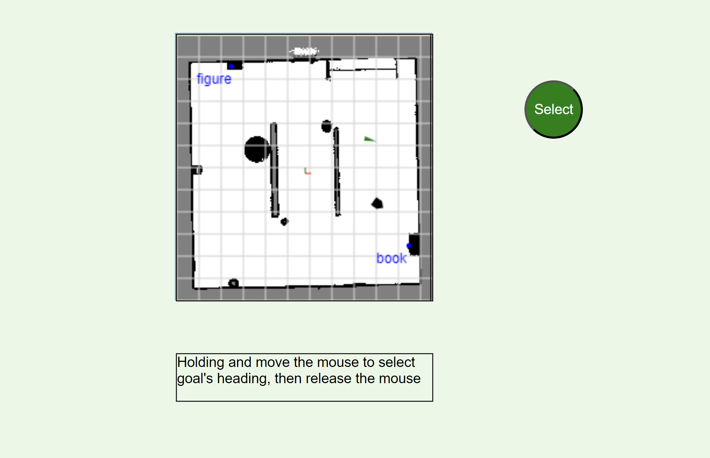

## flask_robot_ros

# Installation

1. Install Flask, ROS Noetic and Navigation Stack.

2. Clone flask_robot_ros in ROS workspace

```bash
git clone https://github.com/KorawitGems/flask_robot_ros.git
```

# Run

```bash
roslaunch flask_robot_ros flask_ros_interface.launch
```
<p align="center">
  
</p>

<p align="center">
  
</p>


Send goal to navigate robot via web GUI.


<p align="center">
  
</p>
