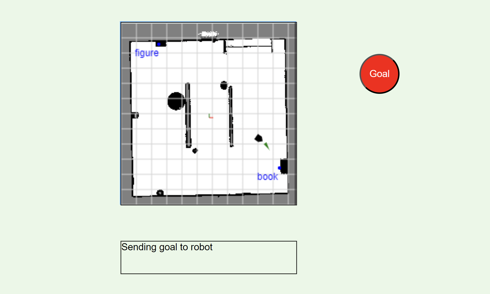
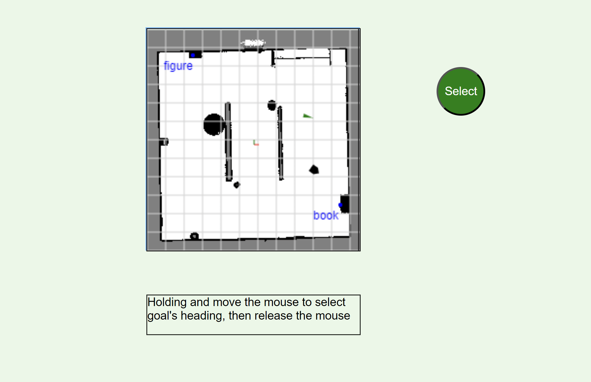

## flask_robot_ros

## Installation

```bash
git clone https://github.com/KorawitGems/flask_robot_ros.git
```

## Run

```bash
roslaunch flask_robot_ros flask_ros_interface.launch
```

<p align="center">
  
</p>

Send goal to navigate robot by ROS interface with flask

<p align="center">
  
</p>
